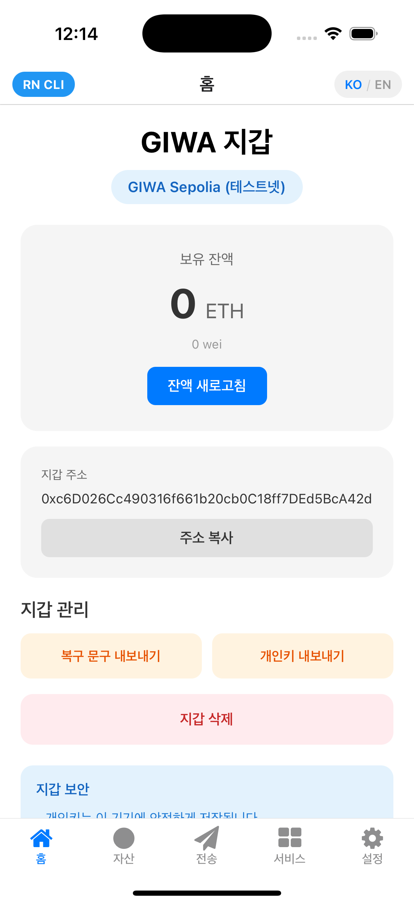
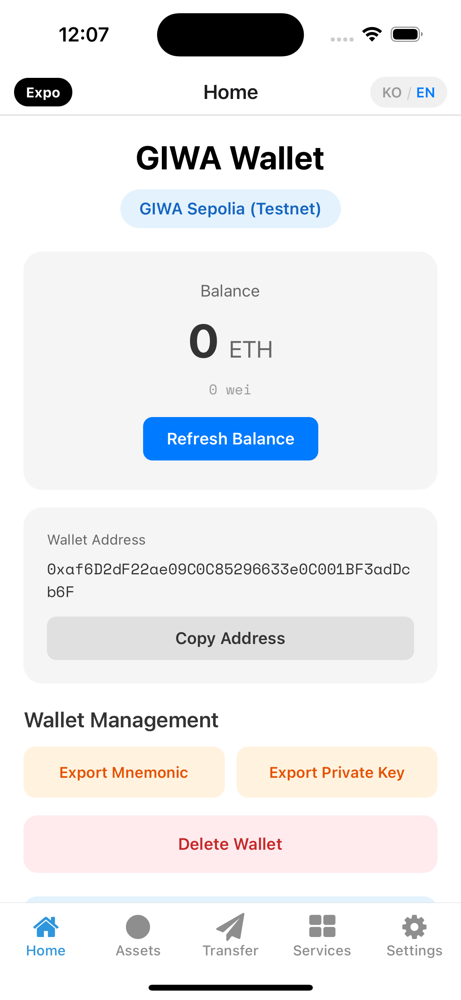

# GIWA React Native SDK Samples

This repository contains sample applications demonstrating the usage of [giwa-react-native-wallet](https://www.npmjs.com/package/giwa-react-native-wallet) SDK.

## Sample Apps

| App | Environment | Simulator | Status |
|-----|-------------|-----------|--------|
| [expo-wallet](./expo-wallet) | Expo SDK 54 | iPhone 16 | ✅ Working |
| [rn-cli-wallet](./rn-cli-wallet) | React Native CLI 0.83 | iPhone 16 Pro | ✅ Working |

Both apps have **identical UI and features**, only the underlying environment differs.

## Screenshots

| rn-cli-wallet (Korean) | expo-wallet (English) |
|:----------------------:|:---------------------:|
|  |  |

## Quick Start

### Expo Wallet

```bash
cd expo-wallet
npm install

# Development build (recommended)
npx expo run:ios

# Or use Expo Go (limited features)
npx expo start
```

### React Native CLI Wallet

```bash
cd rn-cli-wallet
npm install

# iOS
cd ios && pod install && cd ..
npx react-native run-ios

# Android
npx react-native run-android
```

## SDK Features Demonstrated

Both sample apps demonstrate the following SDK features:

| Feature | Status | Description |
|---------|--------|-------------|
| **Wallet Management** | ✅ Available | Create, recover, import/export wallets |
| **Balance** | ✅ Available | Check ETH balance with real-time updates |
| **Transactions** | ✅ Available | Send ETH to other addresses |
| **Token Management** | ✅ Available | Add/remove ERC-20 tokens, check balances, transfer |
| **Flashblocks** | ✅ Available | Fast transaction preconfirmations |
| **Faucet** | ✅ Available | Get testnet ETH (testnet only) |
| **Network Info** | ✅ Available | Check network status and feature availability |
| **L1 Bridge** | 🚧 Coming Soon | L2 to L1 withdrawal (contract not deployed) |
| **GIWA ID** | 🚧 Coming Soon | ENS-like name service (contract not deployed) |
| **Dojang** | 🚧 Coming Soon | EAS-based attestation (contract not deployed) |

> **Note**: Features marked as "Coming Soon" are waiting for smart contract deployment on testnet. The SDK and UI are ready.

## App Comparison

| Feature | expo-wallet | rn-cli-wallet |
|---------|-------------|---------------|
| **Framework** | Expo SDK 54 | React Native 0.83 |
| **Routing** | Expo Router (file-based) | React Navigation |
| **Clipboard** | expo-clipboard | @react-native-clipboard/clipboard |
| **Secure Storage** | expo-secure-store | react-native-keychain |
| **Icons** | @expo/vector-icons | react-native-vector-icons |
| **Web Support** | ✅ Yes | ❌ No |
| **Environment Badge** | Black "Expo" | Blue "RN CLI" |

## SDK Installation

```bash
npm install giwa-react-native-wallet
```

### Basic Usage

```typescript
import { GiwaProvider, useGiwaWallet, useBalance } from 'giwa-react-native-wallet';

// Wrap your app with GiwaProvider
function App() {
  return (
    <GiwaProvider config={{ network: 'testnet' }}>
      <YourApp />
    </GiwaProvider>
  );
}

// Use hooks in your components
function WalletScreen() {
  const { wallet, hasWallet, createWallet } = useGiwaWallet();
  const { formattedBalance, refetch } = useBalance();

  // ...
}
```

## Requirements

| Requirement | Version |
|-------------|---------|
| Node.js | >= 20.0.0 |
| React Native | >= 0.83.0 |
| Expo SDK | >= 54.0.0 (for Expo apps) |
| iOS | >= 13.4 |
| Android | >= API 21 (Lollipop) |

## Project Structure

```
giwa-react-native-samples/
├── README.md                 # This file
├── expo-wallet/              # Expo-based sample app
│   ├── app/                  # Expo Router screens
│   │   └── (tabs)/           # Tab-based navigation
│   ├── lib/                  # Shared utilities (i18n)
│   └── package.json
├── rn-cli-wallet/            # React Native CLI sample app
│   ├── src/
│   │   ├── screens/          # Screen components
│   │   └── lib/              # Shared utilities (i18n)
│   ├── ios/                  # iOS native code
│   ├── android/              # Android native code
│   └── package.json
└── docs/                     # Documentation assets
```

## Internationalization

Both apps support Korean (ko) and English (en) languages:
- Default language: Korean
- Toggle available in header (KO / EN button)
- Language preference is persisted

## Troubleshooting

### Common Issues

1. **Metro bundler port conflict**
   ```bash
   # Kill existing Metro processes
   pkill -f metro
   # Or use a different port
   npx react-native start --port 8082
   ```

2. **iOS build fails**
   ```bash
   cd ios
   rm -rf Pods Podfile.lock
   pod install
   ```

3. **Icons not showing (RN CLI)**
   - Make sure fonts are linked in `Info.plist`
   - Run `npx react-native-asset` to link fonts

4. **Expo build fails**
   ```bash
   rm -rf ios/Pods ios/build
   npx expo run:ios
   ```

## License

MIT

## Links

- [giwa-react-native-wallet on npm](https://www.npmjs.com/package/giwa-react-native-wallet)
- [SDK Documentation](https://github.com/dev-eyoungmin/giwa-react-native-wallet)
